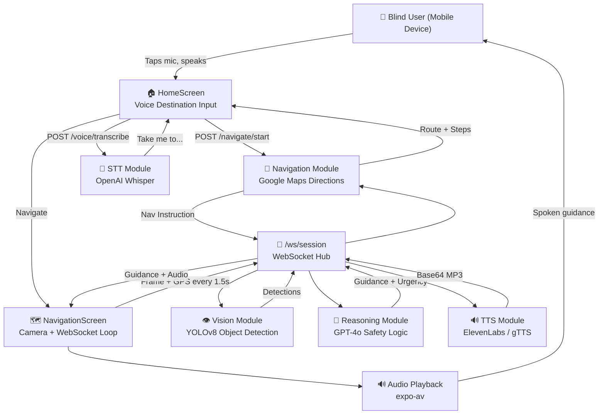

# BlindBuddy — System Architecture

## Overview



---

## Safety Priority Rules

| Urgency | Trigger | Voice Output |
|---------|---------|-------------|
| 🚨 HIGH | Object < 1.5m **OR** vehicle/stairs < 3m | "Stop." / "Wait." |
| ⚠️ MEDIUM | Object 1.5–3m away | "Slow down." |
| ✅ LOW | No hazards / distant objects | Navigation instruction |

Safety always overrides navigation — obstacle warning comes first.

---

## API Endpoints

| Method | Endpoint | Description |
|--------|----------|-------------|
| `GET` | `/health` | Health check |
| `POST` | `/navigate/start` | Get route from current location to destination |
| `POST` | `/navigate/update` | Get next step based on current GPS |
| `POST` | `/vision/detect` | Object detection from uploaded image |
| `POST` | `/vision/detect-base64` | Object detection from base64 image |
| `POST` | `/reason` | AI reasoning: nav + vision → guidance |
| `POST` | `/voice/transcribe` | Audio → text (Whisper) |
| `POST` | `/voice/synthesize` | Text → MP3 binary |
| `POST` | `/voice/synthesize-base64` | Text → base64 MP3 |
| `WS` | `/ws/session` | Real-time guidance session |

---

## WebSocket Message Protocol

### Client → Server (frame)
```json
{
  "type": "frame",
  "image": "<base64 JPEG>",
  "lat": 37.7749,
  "lng": -122.4194,
  "step_index": 1,
  "steps": [...],
  "nav_instruction": "Turn right in 50 meters"
}
```

### Server → Client (guidance)
```json
{
  "type": "guidance",
  "text": "Slow down. A car is approaching from your right.",
  "urgency": "HIGH",
  "audio": "<base64 MP3>",
  "step_info": {"instruction": "...", "distance_remaining_m": 45, "advance": false},
  "detections": [{"object": "car", "direction": "right", "distance": "2 meters"}]
}
```

---

## Sample LLM Interactions

**Scenario 1: Navigation only**
- Nav: "Turn right in 10 meters"
- Vision: No objects
- Output: *"Turn right in 10 meters. Path looks clear."*

**Scenario 2: Hazard override**
- Nav: "Turn right in 10 meters"
- Vision: `{"object": "car", "direction": "right", "distance": "1.5 meters"}`
- Output: *"Stop. A car is very close on your right. Wait before turning."*

**Scenario 3: Stairs**
- Nav: "Continue straight"
- Vision: `{"object": "stairs", "direction": "ahead", "distance": "2 meters"}`
- Output: *"Stop. Stairs directly ahead. Feel for the handrail before continuing."*

**Scenario 4: Off route**
- Deviation detected (> 25m from route)
- Output: *"You have veered off the route. Please turn around and head south."*
